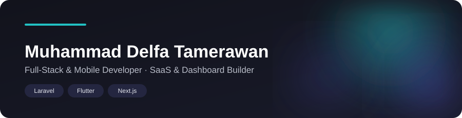

 

💻 Coding Enthusiast &nbsp;|&nbsp; 📱 Mobile Dev &nbsp;|&nbsp; 🚀 SaaS Builder &nbsp;|&nbsp; 🖥️ Full-Stack Developer

  

 

## Tech Stack

 

## Currently Building

Building full-stack applications and dashboard systems for clients, with a focus on clean architecture and practical, reliable delivery.

 

## GitHub Statistics

 

**Open to collaborating on impactful, well-built products.**

