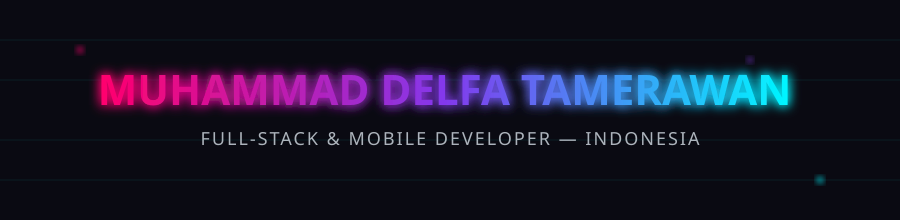

<div align="center">




<br/>

<a href="https://delfa-23.github.io/portofolio-delfa/"></a>
<a href="https://www.linkedin.com/in/delfa-tamerawan/"></a>
<a href="https://wa.me/628111443260"></a>


</div>


### `>` CHARACTER SHEET

<table width="100%">
<tr>
<td width="58%" valign="top">

**Class:** Full-Stack & Mobile Developer
**Origin:** Indonesia 🇮🇩
**Guild affiliations:** PLN · Educational institutions
**Passive trait:** turns rough ideas into shipped, working builds
**Currently grinding:** advanced app architecture & backend systems

> *"Not just code that runs. Code that ships, scales, and doesn't page anyone at 2am."*

</td>
<td width="42%" valign="top">

```js
const player = {
  tag: "delfa-23",
  class: "Full-Stack & Mobile Dev",
  region: "Indonesia 🇮🇩",
  mainWeapons: ["Laravel", "Flutter", "Firebase"],
  status: "LFG — open to collab",
};

export default player;
```

</td>
</tr>
</table>


### `>` INVENTORY

<div align="center">


<br/><br/>

| Slot | Equipped |
|---|---|
| ⚔️ Primary weapon | `Laravel` — backend & APIs |
| ⚔️ Primary weapon | `Next.js` — React framework, SSR/SSG |
| 🛡️ Secondary weapon | `Flutter` — cross-platform mobile |
| 🔋 Power core | `Firebase` — realtime data & auth |
| 🔋 Power core | `Supabase` — Postgres backend-as-a-service |
| 🚀 Deploy portal | `Vercel` `Netlify` |
| 🗺️ Utility belt | `JavaScript` `PHP` `MySQL` `Git` |

</div>


### `>` QUEST LOG

<details open>
<summary><b>🧾 FastReq</b> <code>[CLIENT QUEST]</code> — Procurement request system with manager approval workflow</summary>
<br/>

**Loot:** `Laravel`

</details>

<details open>
<summary><b>🗼 Monitoring Tower</b> <code>[RAID — PLN]</code> — Tower data management with Google Maps integration</summary>
<br/>

**Loot:** `Flutter` `Firebase` `Google Maps API`

</details>

<details open>
<summary><b>📋 SI MAGER</b> <code>[RAID — PLN]</code> — Multi-user work management system with task tracking & deadlines</summary>
<br/>

**Loot:** `Web` `Mobile`

</details>

<details>
<summary><b>🏥 Health Apps</b> <code>[SOLO QUEST]</code> — Medical record management system for patient data and doctors</summary>
<br/>

**Loot:** `Flutter` `Firebase`

</details>

<details>
<summary><b>🛒 KasirKu Bengkel</b> <code>[SOLO QUEST]</code> — POS system with barcode scanning and automated stock management</summary>
<br/>

**Loot:** `Flutter` `Firebase`

</details>


### `>` PLAYER STATS

<div align="center">


</div>


### `>` ACHIEVEMENTS UNLOCKED

<div align="center">


</div>


### `>` CONTRIBUTION LOG

<div align="center">
  
</div>

<sub>Powered by the <a href="https://github.com/Platane/snk">Platane/snk</a> Action (one-time setup) — set its <code>palette</code> to <code>["#0a0a12","#FF006E","#8338EC","#00F5FF"]</code> to match the RGB theme.</sub>

<br/><br/>

<div align="center">

**🎮 CO-OP INVITE — send party request to collaborate**

<a href="https://www.linkedin.com/in/delfa-tamerawan/"></a>
<a href="https://wa.me/628111443260"></a>

<br/><br/>


</div>